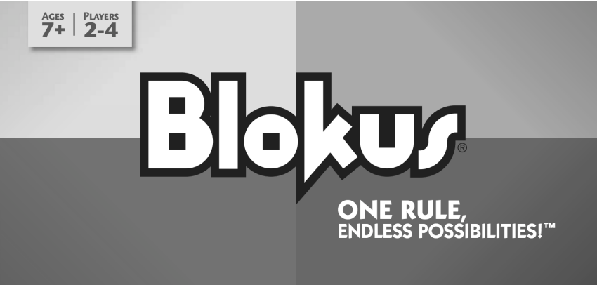

 # Manual de Utilizador 
<br>


### <p style="text-align: center;"> Inteligencia Artificial 2020/21</p>


  ## <p style="text-align: center;"> BLOKUS </p>

<br>


                                                                                                                           

<div style="text-align:center"></div>

<br>

## <p style="text-align: center;"> PROJETO 2

<p style="text-align: center;"> <b>Docente:</b> Joaquim Filipe</p>


 ### <p style="text-align: center;"> <b> Realizado por :</b> </p>
 <p style="text-align: center;">Bernardo Mota nº201900947
 <br>
Frederico Alcaria nº201701440 </p>

<div style="page-break-after: always;"></div>

## Acrónimos

* **IDE**: integrated deveopment environment (ambiente de desenvolvimento integrado)

<br>

# Introdução

Este manual visa a ser um guia compreensivo para a correta utilização do programa desenvolvido, utilizando a linguagem de programação funcional LISP. O objetivo deste programa é indicar quais os passos necessários para utilizar a aplicação sem problemas. Esta versão do Blokus tem 2 modos de jogo, Humano VS Computador e Computador VS Computador.

<br>

# Instalação e utilização

Para puder executar o programa é necessário o IDE [LispWorks](http://www.lispworks.com/) ou outro que consiga interpretar a linguagem LISP.

## Abrir e Compilar os ficheiros

No LispWorks vai ser preciso compilar o ficheiro jogo.lisp. Ir File>Compile and Load e escolher o ficheiro project.lisp. Os restantes ficheiros vão ser compilados ao iniciar o programa, irá ser pedido o path de onde se encontram os ficheiros do projeto necessários (jogo.lisp , puzzle.lisp , algoritmo.dat). 

## Executar o Programa

Para executar o programa é necessário abrir um listener e chamar a função iniciar escrevendo (iniciar)

## Navegar no Programa

Para navegar no programa é necessário escrever na consola o nº respetivo à opção que deseja escolher.

<div style="page-break-after: always;"></div>

# Input/Output

**Tipos de input:**

<ul>
  <li>Consola: A interação com o programa é através do listener. O programa lê o input e corre a opção associada ao nº introduzido.</li>
</ul>

**Tipos de output:**

<ul>
  <li>Ficheiros: o programa vai gerar um ficheiro com o nome log.dat que guarda toda a informação relacionada à execução do programa.</li>
  <li>Consola: A interação com o utilizador é feita através do listener. O programa mostra os menus com as várias opções possíveis, e quando necessário mostram um exemplo de input.</li>
</ul>

O ficheiro log.dat é gerado no durante a execução do jogo e regista a sequência de estados até à conclusão do jogo e as estatísticas de execução. Exemplo em anexo no final do documento.


<div style="page-break-after: always;"></div>

# Exemplo de aplicação

Ao iniciar o programa irá ser pedido o file path até ao local onde se encontra o projeto.

```lisp
Escreva o path da localizacao do projeto entre aspas
Exemplo: ''C:/Users/username/Desktop/''
```

Ao inserir o path surgirá o menu com a seguinte interface, para escolher uma opção é só introduzir no listener o número correspondente à ação que quer realizar.

```lisp
 _____________________________________
|                                     |
|           JOGO DO BLOKUS            |
|                                     |
|     1 - Humano VS Computador        |
|     2 - Computador VS Computador    |
|     3 - Limpar Tabela de Memoização |
|     0 - Sair                        |
|_____________________________________|
 ```

Se escolher 1 irá passar para o modo de jogo de Humano contra Computador, se escolher 2 vai para o modo de jogo Computador contra Computador, se escolher 0 o programa fecha.

A opção 3 serve para limpar tabela de Memoização, <b>é recomendado usar esta opção entre jogos </b>.

Se escolher o modo de jogo Humano VS Computador vai aparecer o menu para escolher qual o jogar que deseja ser.

```lisp
 _____________________________________
|                                     |
|           JOGO DO BLOKUS            |
|                                     |
|    Qual o jogador que deseja?       |
|                                     |
|             1 - Jogador 1           |
|             2 - Jogador 2           |
|             0 - Voltar              |
|                                     |
|_____________________________________|
 ```

Se escolher o modo de jogo Computador VS Computador o menu de escolher o jogador não irá aparecer mas irá aparecer o menu para escolher o tempo limite. O tempo limite define o tempo que o computador têm para fazer a sua jogada. O menu de tempo limite aparece nos dois modos de jogo.


```lisp
 _____________________________________
|                                     |
|           JOGO DO BLOKUS            |
|                                     |
|        Qual o tempo limite?         |
|        Entre 1000 a 20000 ms.       |
|                                     |
|       0 - Voltar                    |
|                                     |
|_____________________________________|
 ```

<div style="page-break-after: always;"></div>

## Modo Computador VS Computador

Após escolher o limite de tempo o jogo é iniciado e irá correr automaticamente até à sua conclusão. Irá mostrar no listener todas as jogadas que ocorreram em conjunto com as estatisitcas relevantes.

Ex:
```lisp
Turno do Jogador 1 
 ------------------- 
PECA-B jogada na posição (0 0) 
X X _ _ _ _ _ _ _ _ _ _ _ _
X X _ _ _ _ _ _ _ _ _ _ _ _
_ _ _ _ _ _ _ _ _ _ _ _ _ _
_ _ _ _ _ _ _ _ _ _ _ _ _ _
_ _ _ _ _ _ _ _ _ _ _ _ _ _
_ _ _ _ _ _ _ _ _ _ _ _ _ _
_ _ _ _ _ _ _ _ _ _ _ _ _ _
_ _ _ _ _ _ _ _ _ _ _ _ _ _
_ _ _ _ _ _ _ _ _ _ _ _ _ _
_ _ _ _ _ _ _ _ _ _ _ _ _ _
_ _ _ _ _ _ _ _ _ _ _ _ _ _
_ _ _ _ _ _ _ _ _ _ _ _ _ _
_ _ _ _ _ _ _ _ _ _ _ _ _ _
_ _ _ _ _ _ _ _ _ _ _ _ _ _
Peças disponiveis: 
Jogador 1: (10 9 15) 
Jogador 2: (10 10 15) 
 
 Melhor valor: 4 
Número nós analisados: 30 
Número cortes-alfa: 2 
Número cortes-beta: 2 
Limite de tempo alcançado: Não 
```
<div style="page-break-after: always;"></div>

## Modo Humano VS Computador

Após escolher o limite de tempo e o jogador que deseja ser o jogo é iniciado. Irá jogar à vez, alternado entre os jogadores. Irá mostrar no listener todas as jogadas que ocorreram em conjunto com as estatisitcas relevantes.
Para jogar vai ser preciso escolher a peça que deseja jogar, e as coordenadas para colocar a peça. Também existe a opção de passar o turno.

Ex:
```lisp
Escolha uma ação:  
  
 1 - peça A 
 2 - peça B 
 3 - peça C-H 
 4 - peça C-V 
 0 - Passar o turno 
  
 -> Opção: 1
 
 Escolha uma linha [0,13]: 0
 
 Escolha uma coluna [0,13]: 0
Turno do Jogador 1 
 ------------------- 
PECA-A jogada na posição (0 0) 
X _ _ _ _ _ _ _ _ _ _ _ _ _
_ _ _ _ _ _ _ _ _ _ _ _ _ _
_ _ _ _ _ _ _ _ _ _ _ _ _ _
_ _ _ _ _ _ _ _ _ _ _ _ _ _
_ _ _ _ _ _ _ _ _ _ _ _ _ _
_ _ _ _ _ _ _ _ _ _ _ _ _ _
_ _ _ _ _ _ _ _ _ _ _ _ _ _
_ _ _ _ _ _ _ _ _ _ _ _ _ _
_ _ _ _ _ _ _ _ _ _ _ _ _ _
_ _ _ _ _ _ _ _ _ _ _ _ _ _
_ _ _ _ _ _ _ _ _ _ _ _ _ _
_ _ _ _ _ _ _ _ _ _ _ _ _ _
_ _ _ _ _ _ _ _ _ _ _ _ _ _
_ _ _ _ _ _ _ _ _ _ _ _ _ _
Peças disponiveis: 
Jogador 1: (9 10 15) 
Jogador 2: (10 10 15) 
```

<div style="page-break-after: always;"></div>

# Anexo

Exemplo do log.dat:

```lisp
/////////////////////////////////////////////////////////////////////////
Jogo: Computador VS Computador 
Tempo limite: 1000 milisegundos 
/////////////////////////////////////////////////////////////////////////
Turno do Jogador 1 
 ------------------- 
PECA-B jogada na posição (0 0) 
X X _ _ _ _ _ _ _ _ _ _ _ _
X X _ _ _ _ _ _ _ _ _ _ _ _
_ _ _ _ _ _ _ _ _ _ _ _ _ _
_ _ _ _ _ _ _ _ _ _ _ _ _ _
_ _ _ _ _ _ _ _ _ _ _ _ _ _
_ _ _ _ _ _ _ _ _ _ _ _ _ _
_ _ _ _ _ _ _ _ _ _ _ _ _ _
_ _ _ _ _ _ _ _ _ _ _ _ _ _
_ _ _ _ _ _ _ _ _ _ _ _ _ _
_ _ _ _ _ _ _ _ _ _ _ _ _ _
_ _ _ _ _ _ _ _ _ _ _ _ _ _
_ _ _ _ _ _ _ _ _ _ _ _ _ _
_ _ _ _ _ _ _ _ _ _ _ _ _ _
_ _ _ _ _ _ _ _ _ _ _ _ _ _
Peças disponiveis: 
Jogador 1: (10 9 15) 
Jogador 2: (10 10 15) 
 
 Melhor valor: 4 
Número nós analisados: 30 
Número cortes-alfa: 2 
Número cortes-beta: 2 
Limite de tempo alcançado: Não 
 
Turno do Jogador 2 
 ------------------- 
PECA-B jogada na posição (12 12) 
X X _ _ _ _ _ _ _ _ _ _ _ _
X X _ _ _ _ _ _ _ _ _ _ _ _
_ _ _ _ _ _ _ _ _ _ _ _ _ _
_ _ _ _ _ _ _ _ _ _ _ _ _ _
_ _ _ _ _ _ _ _ _ _ _ _ _ _
_ _ _ _ _ _ _ _ _ _ _ _ _ _
_ _ _ _ _ _ _ _ _ _ _ _ _ _
_ _ _ _ _ _ _ _ _ _ _ _ _ _
_ _ _ _ _ _ _ _ _ _ _ _ _ _
_ _ _ _ _ _ _ _ _ _ _ _ _ _
_ _ _ _ _ _ _ _ _ _ _ _ _ _
_ _ _ _ _ _ _ _ _ _ _ _ _ _
_ _ _ _ _ _ _ _ _ _ _ _ O O
_ _ _ _ _ _ _ _ _ _ _ _ O O
Peças disponiveis: 
Jogador 1: (10 9 15) 
Jogador 2: (10 9 15) 
 
 Melhor valor: 0 
Número nós analisados: 45 
Número cortes-alfa: 4 
Número cortes-beta: 2 
Limite de tempo alcançado: Não 
 
Turno do Jogador 1 
 ------------------- 
PECA-C-H jogada na posição (2 2) 
X X _ _ _ _ _ _ _ _ _ _ _ _
X X _ X X _ _ _ _ _ _ _ _ _
_ _ X X _ _ _ _ _ _ _ _ _ _
_ _ _ _ _ _ _ _ _ _ _ _ _ _
_ _ _ _ _ _ _ _ _ _ _ _ _ _
_ _ _ _ _ _ _ _ _ _ _ _ _ _
_ _ _ _ _ _ _ _ _ _ _ _ _ _
_ _ _ _ _ _ _ _ _ _ _ _ _ _
_ _ _ _ _ _ _ _ _ _ _ _ _ _
_ _ _ _ _ _ _ _ _ _ _ _ _ _
_ _ _ _ _ _ _ _ _ _ _ _ _ _
_ _ _ _ _ _ _ _ _ _ _ _ _ _
_ _ _ _ _ _ _ _ _ _ _ _ O O
_ _ _ _ _ _ _ _ _ _ _ _ O O
Peças disponiveis: 
Jogador 1: (10 9 14) 
Jogador 2: (10 9 15) 
 
 Melhor valor: 4 
Número nós analisados: 121 
Número cortes-alfa: 3 
Número cortes-beta: 4 
Limite de tempo alcançado: Não 
 
Turno do Jogador 2 
 ------------------- 
PECA-C-H jogada na posição (10 11) 
X X _ _ _ _ _ _ _ _ _ _ _ _
X X _ X X _ _ _ _ _ _ _ _ _
_ _ X X _ _ _ _ _ _ _ _ _ _
_ _ _ _ _ _ _ _ _ _ _ _ _ _
_ _ _ _ _ _ _ _ _ _ _ _ _ _
_ _ _ _ _ _ _ _ _ _ _ _ _ _
_ _ _ _ _ _ _ _ _ _ _ _ _ _
_ _ _ _ _ _ _ _ _ _ _ _ _ _
_ _ _ _ _ _ _ _ _ _ _ _ _ _
_ _ _ _ _ _ _ _ _ _ _ _ _ _
_ _ _ _ _ _ _ _ _ _ _ O O _
_ _ _ _ _ _ _ _ _ _ O O _ _
_ _ _ _ _ _ _ _ _ _ _ _ O O
_ _ _ _ _ _ _ _ _ _ _ _ O O
Peças disponiveis: 
Jogador 1: (10 9 14) 
Jogador 2: (10 9 14) 
 
 Melhor valor: 0 
Número nós analisados: 184 
Número cortes-alfa: 25 
Número cortes-beta: 3 
Limite de tempo alcançado: Não 
 
Turno do Jogador 1 
 ------------------- 
PECA-C-H jogada na posição (4 3) 
X X _ _ _ _ _ _ _ _ _ _ _ _
X X _ X X _ _ _ _ _ _ _ _ _
_ _ X X _ X X _ _ _ _ _ _ _
_ _ _ _ X X _ _ _ _ _ _ _ _
_ _ _ _ _ _ _ _ _ _ _ _ _ _
_ _ _ _ _ _ _ _ _ _ _ _ _ _
_ _ _ _ _ _ _ _ _ _ _ _ _ _
_ _ _ _ _ _ _ _ _ _ _ _ _ _
_ _ _ _ _ _ _ _ _ _ _ _ _ _
_ _ _ _ _ _ _ _ _ _ _ _ _ _
_ _ _ _ _ _ _ _ _ _ _ O O _
_ _ _ _ _ _ _ _ _ _ O O _ _
_ _ _ _ _ _ _ _ _ _ _ _ O O
_ _ _ _ _ _ _ _ _ _ _ _ O O
Peças disponiveis: 
Jogador 1: (10 9 13) 
Jogador 2: (10 9 14) 
 
 Melhor valor: 4 
Número nós analisados: 333 
Número cortes-alfa: 14 
Número cortes-beta: 12 
Limite de tempo alcançado: Não 
 
Turno do Jogador 2 
 ------------------- 
PECA-C-H jogada na posição (9 9) 
X X _ _ _ _ _ _ _ _ _ _ _ _
X X _ X X _ _ _ _ _ _ _ _ _
_ _ X X _ X X _ _ _ _ _ _ _
_ _ _ _ X X _ _ _ _ _ _ _ _
_ _ _ _ _ _ _ _ _ _ _ _ _ _
_ _ _ _ _ _ _ _ _ _ _ _ _ _
_ _ _ _ _ _ _ _ _ _ _ _ _ _
_ _ _ _ _ _ _ _ _ _ _ _ _ _
_ _ _ _ _ _ _ _ _ _ O O _ _
_ _ _ _ _ _ _ _ _ O O _ _ _
_ _ _ _ _ _ _ _ _ _ _ O O _
_ _ _ _ _ _ _ _ _ _ O O _ _
_ _ _ _ _ _ _ _ _ _ _ _ O O
_ _ _ _ _ _ _ _ _ _ _ _ O O
Peças disponiveis: 
Jogador 1: (10 9 13) 
Jogador 2: (10 9 13) 
 
 Melhor valor: 0 
Número nós analisados: 410 
Número cortes-alfa: 20 
Número cortes-beta: 14 
Limite de tempo alcançado: Não 
 
Turno do Jogador 1 
 ------------------- 
PECA-C-V jogada na posição (7 3) 
X X _ _ _ _ _ _ _ _ _ _ _ _
X X _ X X _ _ _ _ _ _ _ _ _
_ _ X X _ X X _ _ _ _ _ _ _
_ _ _ _ X X _ X _ _ _ _ _ _
_ _ _ _ _ _ _ X X _ _ _ _ _
_ _ _ _ _ _ _ _ X _ _ _ _ _
_ _ _ _ _ _ _ _ _ _ _ _ _ _
_ _ _ _ _ _ _ _ _ _ _ _ _ _
_ _ _ _ _ _ _ _ _ _ O O _ _
_ _ _ _ _ _ _ _ _ O O _ _ _
_ _ _ _ _ _ _ _ _ _ _ O O _
_ _ _ _ _ _ _ _ _ _ O O _ _
_ _ _ _ _ _ _ _ _ _ _ _ O O
_ _ _ _ _ _ _ _ _ _ _ _ O O
Peças disponiveis: 
Jogador 1: (10 9 12) 
Jogador 2: (10 9 13) 
 
 Melhor valor: 4 
Número nós analisados: 863 
Número cortes-alfa: 20 
Número cortes-beta: 20 
Limite de tempo alcançado: Não 
 
Turno do Jogador 2 
 ------------------- 
PECA-C-V jogada na posição (11 5) 
X X _ _ _ _ _ _ _ _ _ _ _ _
X X _ X X _ _ _ _ _ _ _ _ _
_ _ X X _ X X _ _ _ _ _ _ _
_ _ _ _ X X _ X _ _ _ _ _ _
_ _ _ _ _ _ _ X X _ _ _ _ _
_ _ _ _ _ _ _ _ X _ _ O _ _
_ _ _ _ _ _ _ _ _ _ _ O O _
_ _ _ _ _ _ _ _ _ _ _ _ O _
_ _ _ _ _ _ _ _ _ _ O O _ _
_ _ _ _ _ _ _ _ _ O O _ _ _
_ _ _ _ _ _ _ _ _ _ _ O O _
_ _ _ _ _ _ _ _ _ _ O O _ _
_ _ _ _ _ _ _ _ _ _ _ _ O O
_ _ _ _ _ _ _ _ _ _ _ _ O O
Peças disponiveis: 
Jogador 1: (10 9 12) 
Jogador 2: (10 9 12) 
 
 Melhor valor: 0 
Número nós analisados: 787 
Número cortes-alfa: 32 
Número cortes-beta: 20 
Limite de tempo alcançado: Não 
```